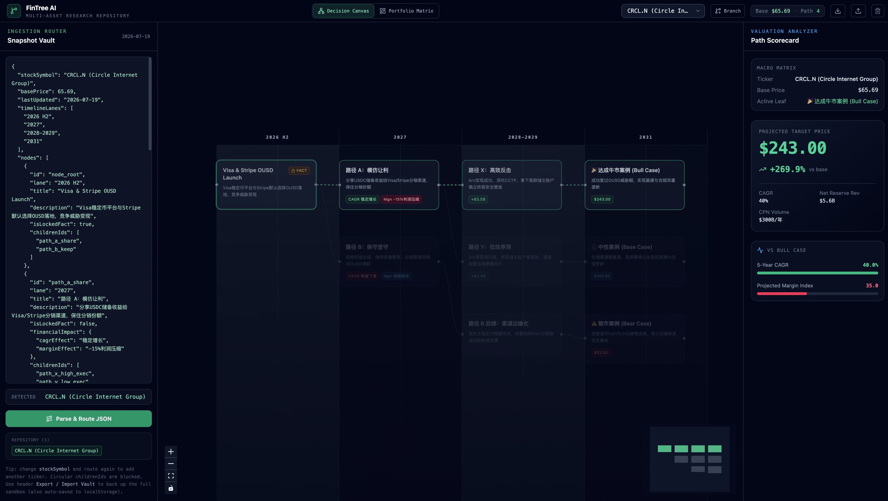
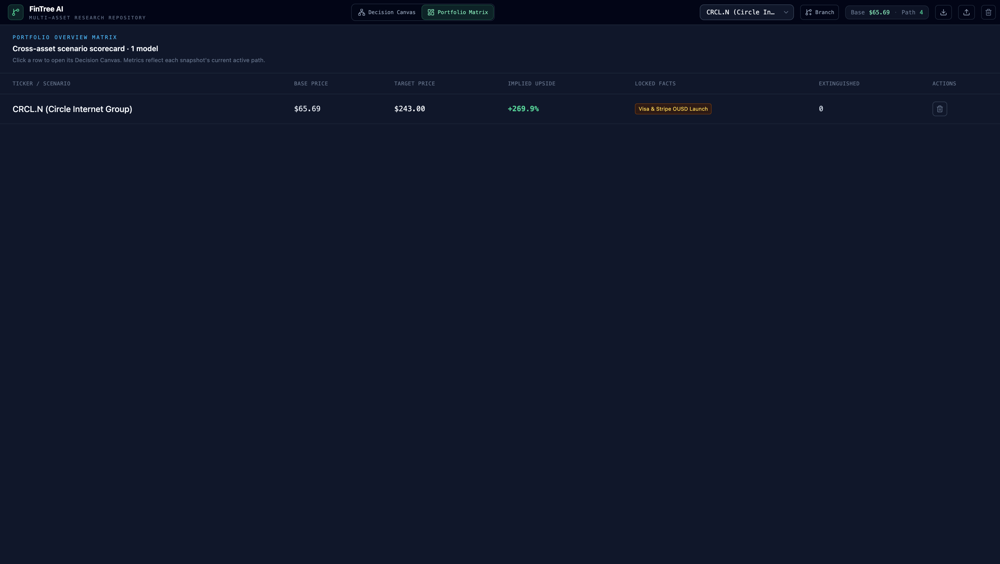

# FinTree AI

**Multi-asset strategic path research sandbox** for equity analysts.

Paste structured JSON for any ticker, explore decision trees on a timeline, lock historical facts, branch what-if scenarios, and compare everything in a portfolio matrix — without changing application code.

---

## UI preview

### Decision Canvas (three-panel workspace)



| Region | What it does |
|--------|----------------|
| **Header** | View switcher · asset dropdown · Branch · Export/Import Vault |
| **Left — Ingestion Router** | Paste JSON · **Parse & Route** · conflict merge/overwrite |
| **Center — Decision Canvas** | Timeline lanes + React Flow nodes · active path glow |
| **Right — Valuation Analyzer** | Target price, upside %, CAGR / margin gauges |

### Portfolio Overview Matrix



Full-width scorecard across every loaded scenario: base price, active-path target, implied upside, locked facts, extinguished branch count. Click a row to jump back into that asset’s Decision Canvas.

---

## Quick start

```bash
cd ~/Documents/07_AIcoding/fintree   # or your clone path
npm install
npm run dev
```

Open the URL Vite prints (usually `http://127.0.0.1:5173`).

| Command | Purpose |
|---------|---------|
| `npm run dev` | Local development server |
| `npm run build` | Production build |
| `npm run preview` | Preview the production build |

---

## Core workflows

### 1. Load your first ticker

1. Left panel already has a CRCL sample (or paste from [`examples/`](./examples/)).
2. Click **Parse & Route JSON**.
3. Canvas + valuation panel populate for that asset.

### 2. Add another ticker

1. Change `"stockSymbol"` (e.g. to `"NVDA"`) — keep `basePrice`, `timelineLanes`, and `nodes`.
2. Click **Parse & Route JSON** again.
3. Switch between assets with the **header dropdown**.

One JSON file = one `stockSymbol`. The app stores many assets in a repository vault.

### 3. Existing symbol conflict

If the symbol already exists, FinTree **does not overwrite automatically**. Choose:

- **Combine & Add Branches (Merge)** — incremental patch; locked facts preserved  
- **Wipe Old & Overwrite (Reset)** — replace that symbol’s snapshot only  
- **Cancel** — unlock the editor

### 4. Explore & lock facts

| Action | Result |
|--------|--------|
| Click a node | Select active path (ancestors + heaviest leaf) |
| Double-click | Lock as fact → sibling branches **soft-extinguish** (dimmed, non-clickable) |
| Double-click again | Unlock and revive extinguished siblings |

### 5. Branch a what-if scenario

1. Select an asset in the header.
2. Click **Branch**.
3. Name it (default: `Current Symbol - Copy`), e.g. `NVDA - Bull Case`.
4. A full deep copy is created (path, locks, extinguished) and becomes active.

### 6. Portfolio Matrix

Use the header tabs: **Decision Canvas** ↔ **Portfolio Matrix** to compare all scenarios at once.

### 7. Survive refresh / back up

- Sandbox auto-saves to **localStorage**.
- **Export Vault** / **Import Vault** download or restore a full session JSON file.

---

## How to feed data (JSON format)

Analyst templates live in [`examples/`](./examples/):

| File | Use |
|------|-----|
| [`examples/blank-profile.template.json`](./examples/blank-profile.template.json) | Start a new ticker |
| [`examples/crcl-n.full-profile.json`](./examples/crcl-n.full-profile.json) | Full working CRCL.N profile |
| [`examples/merge-patch.example.json`](./examples/merge-patch.example.json) | Incremental merge sample |
| [`examples/README.md`](./examples/README.md) | Field checklist |

### Required top-level fields

```json
{
  "stockSymbol": "NVDA",
  "basePrice": 120.5,
  "lastUpdated": "2026-07-19",
  "timelineLanes": ["2026 H2", "2027", "2028-2029", "2031"],
  "nodes": [ /* … */ ]
}
```

| Field | Notes |
|-------|--------|
| `stockSymbol` | Repository key (must be unique per scenario) |
| `basePrice` | **Number** (e.g. `65.69`) — used for return % |
| `timelineLanes` | Ordered time columns on the canvas |
| `nodes` | Decision / leaf graph |

### Node rules

- Every `childrenIds` entry must exist as a node `id` (no orphans).
- Every node `lane` should match a `timelineLanes` entry.
- Leaves should include `targetPrice` for the valuation panel.
- Circular `childrenIds` graphs are rejected (topology loop guard).

---

## Architecture (short)

- **Zustand** multi-asset vault: `repository[symbol] → AssetSnapshot`  
  (tree + selection + active path + extinguished IDs)
- **React Flow** decision canvas with timeline swimlanes
- Soft-extinguish instead of hard-delete on fact lock
- localStorage persistence + Export/Import vault

---

## Stack

- React 19 + TypeScript + Vite  
- Zustand  
- `@xyflow/react`  
- Tailwind CSS 4  
